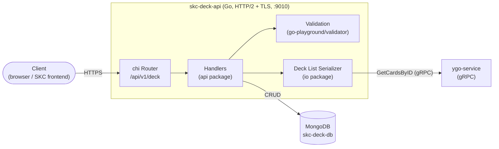
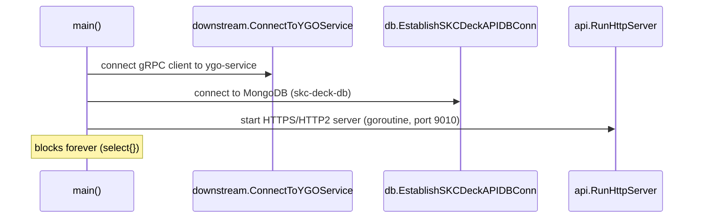
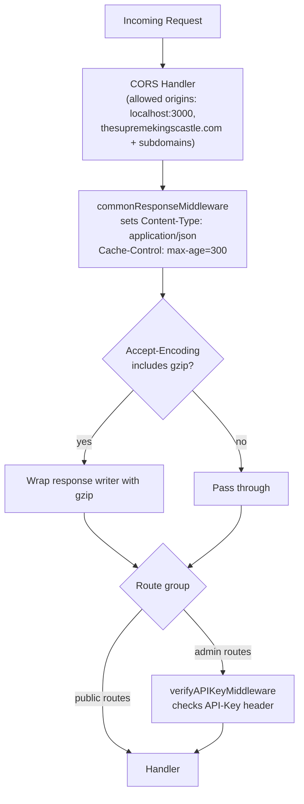
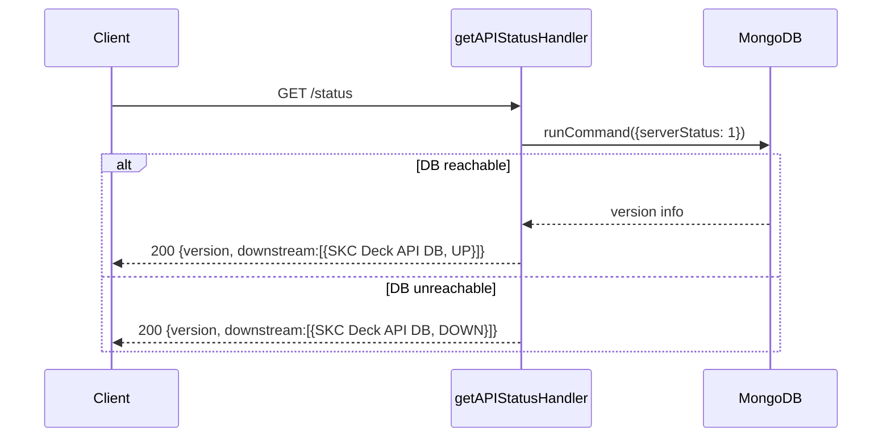
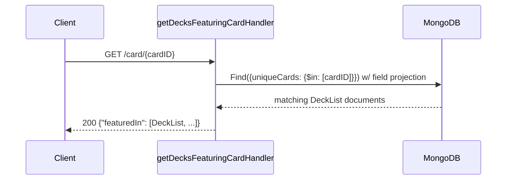
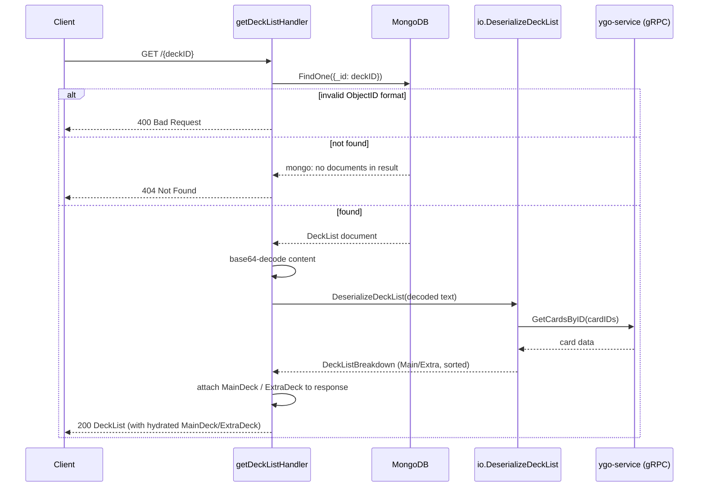
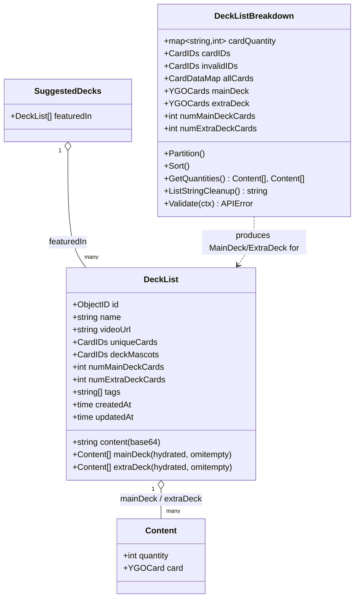
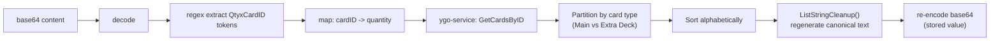

# skc-deck-api — System Documentation

Go HTTP/2 (TLS) API for storing and retrieving Yu-Gi-Oh! deck lists. Built with [chi](https://github.com/go-chi/chi), backed by MongoDB, and dependent on the external `ygo-service` (via gRPC) for card data validation/enrichment.

All routes are namespaced under:

```
/api/v1/deck
```

## Contents

- [Architecture Overview](#architecture-overview)
- [Middleware Pipeline](#middleware-pipeline)
- [Endpoints](#endpoints)
  - [GET /status](#get-apiv1deckstatus)
  - [POST /](#post-apiv1deck)
  - [GET /card/{cardID}](#get-apiv1deckcardcardid)
  - [GET /{deckID}](#get-apiv1deckdeckid)
- [Data Model](#data-model)
- [Deck List Content Encoding](#deck-list-content-encoding)
- [Validation Rules](#validation-rules)

---

## Architecture Overview



**Startup sequence** (`main.go`):



---

## Middleware Pipeline

Every request passes through common middleware before reaching a handler. Admin-only routes (currently none are registered) would additionally require an `API-Key` header.



> Note: as of the current code, the admin route group is defined but has no routes registered — all four endpoints below are public.

---

## Endpoints

| Method | Path                          | Description                                   |
|--------|-------------------------------|------------------------------------------------|
| GET    | `/api/v1/deck/status`         | Health check for API + downstream DB           |
| POST   | `/api/v1/deck/`                | Submit (create) a new deck list                |
| GET    | `/api/v1/deck/card/{cardID}`  | Find decks that feature a given card           |
| GET    | `/api/v1/deck/{deckID}`       | Retrieve a single deck list by its Mongo ID    |

### GET /api/v1/deck/status

Health check endpoint. Verifies DB connectivity by requesting the MongoDB server version; does not check `ygo-service` connectivity.



**Response 200**
```json
{
  "version": "1.0.0",
  "downstream": [
    { "serviceName": "SKC Deck API DB", "status": "UP" }
  ]
}
```

---

### POST /api/v1/deck/

Creates a new deck list. This is the most involved endpoint — it decodes, parses, validates against card data from `ygo-service`, re-normalizes the list content, then persists it.

```mermaid
sequenceDiagram
    participant C as Client
    participant H as submitNewDeckListHandler
    participant V as validation.Validate
    participant IO as io.DeserializeDeckList
    participant YGO as ygo-service (gRPC)
    participant DB as MongoDB

    C->>H: POST / {name, content (base64), videoUrl, deckMascots, tags}
    H->>H: JSON decode body
    alt malformed body
        H-->>C: 422 Unprocessable Entity
    end

    H->>V: struct validation (name, base64, url, mascots, tags)
    alt struct invalid
        V-->>C: 400 Bad Request (field errors)
    end

    H->>H: base64-decode content
    H->>IO: DeserializeDeckList(decoded text)
    IO->>IO: regex-extract "QtyxCardID" tokens<br/>build cardID -> quantity map
    alt duplicate card ID in list
        IO-->>C: 400 Bad Request
    end
    IO->>YGO: GetCardsByID(cardIDs)
    YGO-->>IO: card data + unknown/invalid IDs
    IO->>IO: Partition() into Main/Extra deck<br/>by card type; Sort() alphabetically
    IO-->>H: DeckListBreakdown

    H->>H: DeckListBreakdown.Validate()<br/>(invalid IDs, deck size rules)
    alt breakdown invalid
        H-->>C: 400 Bad Request
    end

    H->>H: re-encode cleaned-up list to base64<br/>set uniqueCards / main+extra counts
    H->>DB: InsertOne(deckList)
    alt insert fails
        DB-->>H: error
        H-->>C: 500 Internal Server Error
    else success
        DB-->>H: insertedID
        H-->>C: 200 {"message": "Successfully inserted new deck list: <name>"}
    end
```

**Request body**
```json
{
  "name": "string (required, custom decklistname format)",
  "content": "string (required, base64-encoded deck list text)",
  "videoUrl": "string (optional, must be a URL if present)",
  "deckMascots": ["cardID", "..."],
  "tags": ["string", "..."]
}
```

**Responses**

| Status | Cause |
|--------|-------|
| 200 | Deck list inserted |
| 400 | Struct validation failed, deck list contains duplicate card IDs, unknown card IDs, or fails main/extra deck size rules |
| 422 | Request body could not be deserialized (malformed JSON) |
| 500 | DB insert failure |

---

### GET /api/v1/deck/card/{cardID}

Returns all decks that include the given card (8-digit card ID) in their `uniqueCards` list. Card content (Main/Extra deck breakdown) is **not** hydrated for these results — only the raw deck metadata stored in Mongo is projected/returned.



Route constraint: `cardID` must match `[0-9]{8}` (chi URL param regex), or the route simply won't match (404 from the router).

---

### GET /api/v1/deck/{deckID}

Retrieves a single deck list by its MongoDB ObjectID and fully hydrates its Main Deck / Extra Deck card contents (calls back through the same deserialize/partition/sort pipeline used on submission).



Route constraint: `deckID` must match `[0-9a-z]+`.

---

## Data Model



Persistence: `DeckList` documents are stored as-is (bson tags) in the `deckListCollection` Mongo collection. The `mainDeck`/`extraDeck` hydrated fields are **not** persisted (`omitempty` + populated only at read/write time from live card data) — only `content`, `uniqueCards`, and the counts are stored.

---

## Deck List Content Encoding

The `content` field is a base64-encoded plain-text deck list using the format:

```
Main Deck
3x89631139|Dark Magician
2x46986414|Kuriboh
...

Extra Deck
1x38517737|Number 39: Utopia
...
```

Only the `QtyxCardID` tokens (matched by regex `[1-3][xX][0-9]{8}`) are actually parsed — card names and section headers are decorative/human-readable and regenerated server-side (`ListStringCleanup`) before persisting, so submitted content is normalized regardless of formatting.



---

## Validation Rules

| Field | Rule |
|---|---|
| `name` | required; must match custom `decklistname` regex validator |
| `content` | required; must be valid base64 |
| `videoUrl` | optional; if present, must be a valid URL |
| `deckMascots` | optional; max 3 entries, each must match card ID regex (`deckmascots` validator) |
| `tags` | required (array, may be empty is not allowed — struct tag is `required`) |
| deck list content (post-decode) | no duplicate card IDs; all card IDs must resolve via `ygo-service` (no `invalidIDs`) |
| Main Deck size | 40–60 cards |
| Extra Deck size | ≤ 15 cards |

Validation happens in two stages:
1. **Struct-level** (`validation.Validate`) — cheap, in-process regex/format checks on the raw request.
2. **Semantic** (`DeckListBreakdown.Validate`) — requires the round trip to `ygo-service` to resolve card IDs, then checks deck composition rules.
